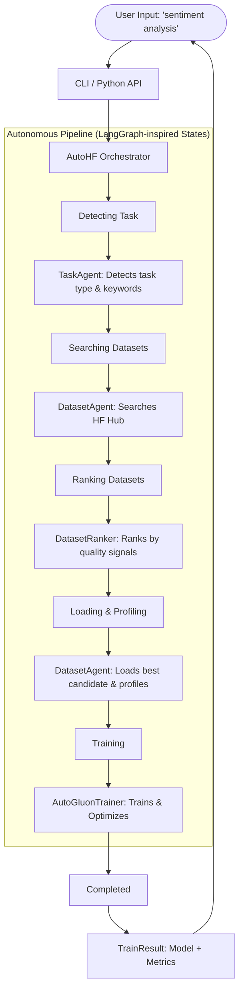
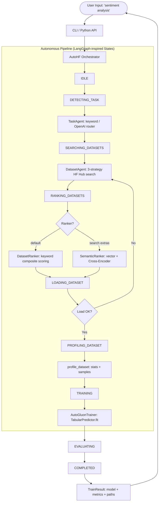
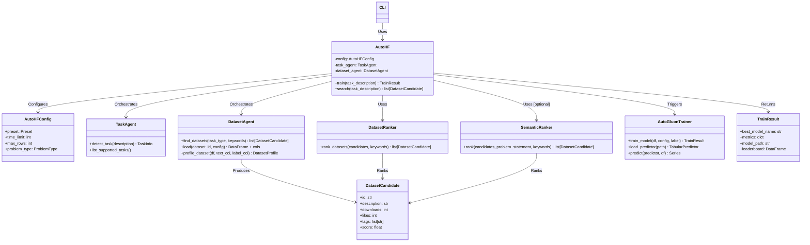

# 🚀 AutoHF

**One-line AutoML: from idea to trained model using Hugging Face + AutoGluon.**

AutoHF is an autonomous machine learning pipeline that takes a natural language description of a task (e.g., "sentiment analysis") and automatically finds the best datasets on Hugging Face, ranks them by quality, and trains a state-of-the-art model using AutoGluon.

---

## ✨ Features

- **🔍 Intent-to-Task:** Automatically detects ML task types (classification, regression, etc.) and keywords from natural language.
- **📦 Autonomous Dataset Discovery:** Searches the Hugging Face Hub for relevant datasets using multi-strategy search.
- **🏆 Intelligent Ranking:** Ranks datasets based on quality signals like downloads, likes, and metadata completeness.
- **🏋️ Automated Training:** Leverages AutoGluon to train high-quality models with minimal configuration.
- **🧬 Agentic Architecture:** Inspired by patterns from **AutoGen**, **LangGraph**, and **OpenHands** for robust state management and collaboration.

---

## 🛠️ Internal Workflow

The following diagram shows how AutoHF orchestrates the pipeline from user input to a trained model:



## 🏗️ Project Structure

AutoHF follows a modular, layered architecture organized into six core packages:

```
autohf/
├── __init__.py                 # Public API exports (AutoHF, AutoHFConfig, TrainResult, etc.)
├── cli/
│   ├── __init__.py
│   └── main.py                 # Typer CLI: train, search, info subcommands
├── core/
│   ├── __init__.py
│   ├── config.py               # Data models, presets, enums (PipelineState, TrainResult, DatasetCandidate...)
│   └── autohf.py               # AutoHF orchestrator — central state-machine coordinator
├── agents/
│   ├── __init__.py
│   ├── task_agent.py           # Intent-to-task detection (keyword / OpenAI router)
│   ├── dataset_agent.py        # Dataset discovery, loading, profiling (3-strategy HF Hub search)
│   └── model_agent.py          # Model search agent (Phase 2 preparation)
├── ranking/
│   ├── __init__.py
│   ├── dataset_ranker.py       # Keyword-based composite scoring (default)
│   ├── semantic_ranker.py      # Vector + Cross-Encoder semantic ranking (optional dep)
│   └── model_ranker.py         # Model ranking stub (Phase 2)
└── training/
    ├── __init__.py
    └── autogluon_trainer.py    # AutoGluon TabularPredictor wrapper (fit, eval, predict)

tests/
├── test_config.py              # Config defaults & preset validation
└── test_task_agent.py          # Keyword detection, fuzzy fallback, history

pyproject.toml                  # Build config, dependencies, CLI entry point, lint/test settings
README.md                       # This file
```

### Module Responsibilities

| Package | Responsibility | Key Classes / Functions |
| :--- | :--- | :--- |
| `core` | Configuration, data models, orchestration | `AutoHFConfig`, `PipelineState`, `AutoHF` |
| `agents` | External interaction — task detection, dataset/model discovery | `TaskAgent`, `DatasetAgent`, `ModelAgent` |
| `ranking` | Relevance & quality scoring for datasets and models | `DatasetRanker`, `SemanticRanker`, `rank_models` |
| `training` | Model training, evaluation, and inference | `train_model`, `load_predictor`, `predict` |
| `cli` | User-facing command-line interface | `train`, `search`, `info` |

## 🏗️ Architecture & Patterns

AutoHF is built using modern software engineering patterns for AI:

- **State Management:** Uses a typed state machine (`PipelineState`) inspired by **LangGraph** to track progress and handle transitions through the pipeline.
- **Agent Collaboration:** Employs specialized agents (`TaskAgent`, `DatasetAgent`, `ModelAgent`) similar to **AutoGen** to separate concerns and enable independent extensibility.
- **Autonomous Execution:** Implements retry logic and multi-strategy discovery patterns found in **OpenHands** for resilient dataset sourcing.
- **Tabular Power:** Uses **AutoGluon** as the underlying engine for robust, automated model selection and hyperparameter tuning.

---

## 🛠️ Internal Workflow

### Pipeline State Machine

The following diagram shows how AutoHF orchestrates the pipeline from user input to a trained model, including retry logic and ranking selection:



### Class / Module Dependency Diagram



### Installation

```bash
# Basic installation
pip install autohf

# With training support (recommended)
pip install "autohf[train]"
```

### CLI Usage

Train a model with a single command:

```bash
# Quick prototype
autohf train "sentiment analysis"

# Higher quality training
autohf train "spam detection" --preset high_quality

# Just search for datasets
autohf search "question answering" --models
```

### Python API

```python
from autohf import AutoHF

# Initialize and train
hf = AutoHF.from_preset("medium_quality")
result = hf.train("customer review classification")

# Access results
print(f"Best model: {result.best_model_name}")
print(f"Accuracy: {result.metrics['accuracy']}")
print(f"Model saved at: {result.model_path}")
```

---

## 📋 Presets

AutoHF provides several presets inspired by AutoGluon to balance speed and quality:

| Preset | Time Limit | Focus |
| :--- | :--- | :--- |
| `quick_prototype` | 60s | Fast iteration, small datasets |
| `medium_quality` | 300s | **Default** - Good balance of speed/quality |
| `high_quality` | 600s | Better results, longer training |
| `best_quality` | 3600s | Maximum performance |
| `optimize_for_deployment` | 300s | Small model size, fast inference |

---

## 🏗️ Architecture & Patterns

AutoHF is built using modern software engineering patterns for AI:

- **State Management:** Uses a typed state machine (via `PipelineState`) inspired by **LangGraph** to track progress and handle transitions.
- **Agent Collaboration:** Employs specialized agents (**TaskAgent**, **DatasetAgent**) similar to **AutoGen** to separate concerns.
- **Autonomous Execution:** Implements retry logic and multi-strategy discovery patterns found in **OpenHands**.
- **Tabular Power:** Uses **AutoGluon** as the underlying engine for robust, automated model selection and hyperparameter tuning.

---

## 🗺️ Project Roadmap

Here is the planned development roadmap for AutoHF. Contributions and suggestions are welcome!

### Phase 1: Core Pipeline (Completed / In Progress)
- [x] Intent-to-Task detection with keyword extraction
- [x] Autonomous Hugging Face dataset search with multi-strategy discovery
- [x] Intelligent dataset ranking (downloads, likes, metadata)
- [x] AutoGluon-based automated training integration
- [x] CLI and Python API entry points
- [x] Configuration presets (quick/medium/high/best quality)
- [x] Agentic architecture with TaskAgent, DatasetAgent, and DatasetRanker

### Phase 2: Enhanced Model Hub
- [ ] Support for custom model fine-tuning (beyond AutoGluon tabular models)
- [ ] Integration with Hugging Face Model Hub for downloading pre-trained models
- [ ] Multi-modal support (image, audio, text classification)
- [ ] Model versioning and experiment tracking

### Phase 3: Advanced Dataset Management
- [ ] Dataset quality validation (missing values, class imbalance detection)
- [ ] Automatic dataset cleaning and preprocessing recommendations
- [ ] Train/validation/test split optimization
- [ ] Dataset caching and local mirror support

### Phase 4: Deployment & Serving
- [ ] Model export to ONNX, TorchScript, and CoreML formats
- [ ] REST API serving with FastAPI
- [ ] Docker containerization for easy deployment
- [ ] Batch prediction pipelines

### Phase 5: Observability & Collaboration
- [ ] Training metrics dashboard
- [ ] Pipeline execution logs and audit trails
- [ ] Team collaboration features (shared datasets, model registry)
- [ ] CI/CD integration for model retraining

### Phase 6: Enterprise Features
- [ ] Private Hugging Face Hub / AWS S3 / Azure Blob Storage support
- [ ] Role-based access control (RBAC)
- [ ] Scalable distributed training support
- [ ] Compliance and governance tooling

---

## 📜 License

MIT License. See `LICENSE` for details.

---

## 🤖 Auto-Push Scripts

AutoHF includes scripts for automated git pushing:

### PowerShell (Windows)
```powershell
.\git-auto-push.ps1 "Your commit message"
.\git-auto-push.ps1 "Your commit message" -Push:$false  # Skip push
```

### Batch (Windows)
```cmd
git-auto-push.bat "Your commit message"
git-auto-push.bat "Your commit message" nopush  # Skip push
```

### Shell/Bash (Linux/macOS/WSL)
```bash
./git-auto-push.sh "Your commit message"
./git-auto-push.sh "Your commit message" nopush  # Skip push
```

These scripts automatically:
1. Stage all changes (`git add -A`)
2. Check for changes
3. Commit with your message
4. Push to the remote repository
